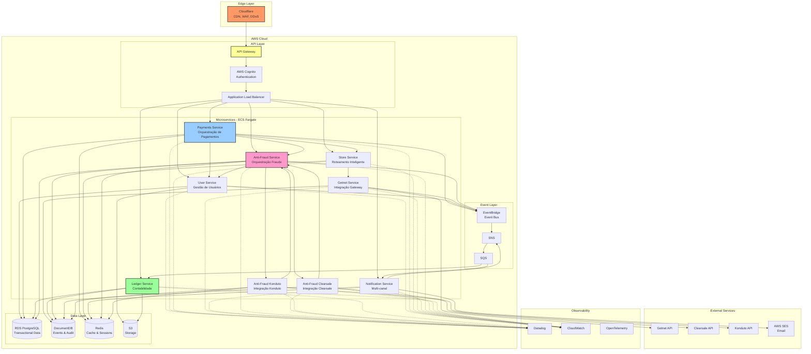

# Diagramas de Arquitetura - Plataforma de Pagamentos

## 1. Visão Geral da Arquitetura

## Referências

- **Documentação de Cenários**: `docs/0-scenarios.md`
- **Mapeamento de Serviços**: `docs/1-service-map.md`
- **Stack Tecnológica**: `docs/2-tech-stack.md`
- **Estratégia de Integração**: `docs/3-integration-stratefy.md`
- **Segurança**: `docs/4-security.md`
- **Observabilidade**: `docs/5-observability.md`
- **Plano de Evolução**: `docs/8-evolution.md`
